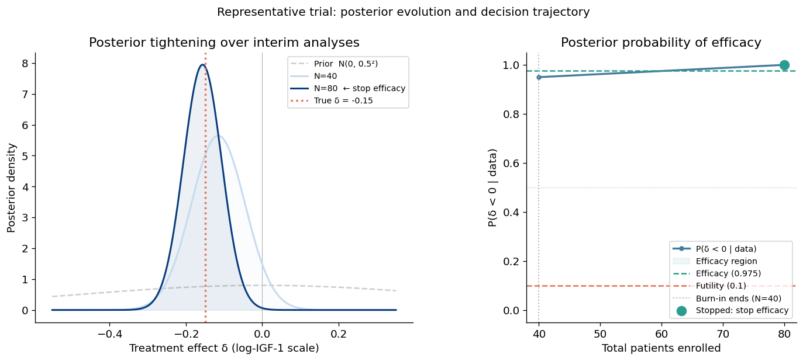
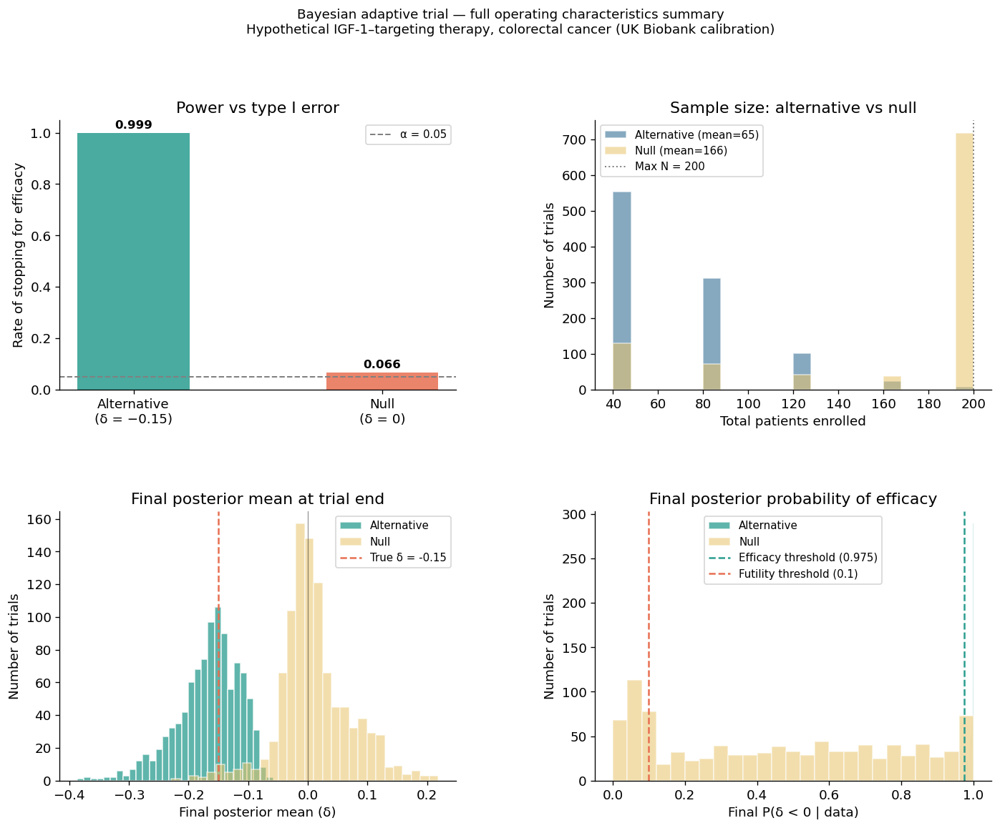

# Bayesian Adaptive Clinical Trial Simulation
### A hypothetical IGF-1–targeting therapy for colorectal cancer


---

## Overview

This project simulates a Bayesian adaptive Phase II clinical trial evaluating a
hypothetical therapy that modulates circulating IGF-1 (insulin-like growth factor 1)
in colorectal cancer patients. The primary outcome is the continuous change in
log-transformed IGF-1 from baseline to 12 weeks.

Rather than assuming arbitrary parameters, the simulation is **calibrated directly
from 1,000 UK Biobank participants** analyzed in a companion regression study
(George & Serafin, 2025), making the scenario statistically grounded in real
biological variability.

The project demonstrates how Bayesian inference methods extend naturally from
parameter estimation into **clinical trial decision-making**.

---

## Background & Motivation

Elevated IGF-1 has been consistently linked to colorectal cancer risk and progression.
In the companion PM-520 analysis, we compared OLS, MCMC, and adaptive MCMC for
predicting log-IGF-1 from age, BMI, diabetic status, sex, and five polygenic risk
scores in UK Biobank participants.

This project asks the natural next question:
> *If a therapy could meaningfully lower circulating IGF-1, how would we design
> and evaluate a clinical trial to detect that effect efficiently?*

Traditional fixed-sample trials commit to a sample size upfront and do not
incorporate evidence as it accumulates. **Bayesian adaptive designs** update
beliefs after each cohort of patients and stop early when evidence is conclusive —
either for efficacy or for futility. This is increasingly the standard approach
in oncology and metabolic disease trials.

---

## Methods

### Statistical model

The outcome for each patient is modeled as:

```
y_i = μ_baseline + δ · arm_i + ε_i,    ε_i ~ N(0, σ²)
```

where δ is the unknown treatment effect and σ is calibrated from UK Biobank OLS residuals.

### Bayesian updating

We use the **Normal-Normal conjugate model** for exact closed-form posterior updates:

```
Prior:      δ ~ N(0, 0.5²)                        [null-centered, weakly informative]
Likelihood: D̄_n | δ ~ N(δ, 2σ²/n)               [mean difference, two arms]
Posterior:  δ | D̄_n ~ N(μ_n, τ_n²)              [exact, no MCMC needed]
```

This closed-form update is computationally orders of magnitude faster than the
NUTS sampler used in the companion study — the right tool when the model permits it.

### Adaptive stopping rules

At each interim analysis (every 20 patients per arm, after a burn-in of 40):

| Condition | Action |
|-----------|--------|
| P(δ < 0 \| data) > 0.975 | Stop for **efficacy** |
| P(δ < 0 \| data) < 0.10  | Stop for **futility** |
| N = 200 reached           | Stop at **max N** |
| Otherwise                 | Continue enrolling |

### Simulation

- **1,000 independent trials** simulated under both the alternative (δ = −0.15)
  and the null (δ = 0)
- Random data generated via **JAX vectorized sampling** for speed
- Sequential decision loop implemented in Python
- Operating characteristics estimated empirically from simulation output

---

## Results

| Metric | Alternative (δ = −0.15) | Null (δ = 0) |
|--------|------------------------|--------------|
| Power / Type I error | 0.999 | 0.066 |
| Mean sample size | 65 | 166 |
| Sample size savings vs fixed N=200 | 67.5%  | 17% |

### Key figures

**Posterior tightening** — how the distribution over δ narrows as evidence accumulates:



**Operating characteristics** — power, type I error, sample size efficiency:



---

## Repo Structure

```
.
├── bayesian_adaptive_trial_igf1_3.ipynb   # Main notebook (Sections 1–5)
├── README.md                            # This file
├── fig_igf1_distribution.png            # Section 2: UK Biobank IGF-1 distribution
├── fig_prior_distribution.png           # Section 2: Prior with reference effects
├── fig_single_trial.png                 # Section 3: Single trial walkthrough
├── fig_decision_breakdown.png           # Section 4: Decision breakdown & sample size
├── fig_posterior_evolution.png          # Section 4: Posterior tightening
├── fig_sample_size_efficiency.png       # Section 4: Cumulative stopping & boxplots
└── fig_full_summary.png                 # Section 4: 4-panel operating characteristics
```

> **Note:** The UK Biobank data file (`igf1_sample_1.csv`) is not included in this
> repository due to data access restrictions. The notebook includes a fallback that
> uses pre-computed parameters derived from the published summary statistics,
> so all cells will run without the raw data.

---

## How to Run

```bash
# 1. Clone the repo
git clone https://github.com/yourusername/bayesian-adaptive-trial-igf1.git
cd bayesian-adaptive-trial-igf1

# 2. Install dependencies
pip install numpy pandas matplotlib scipy jax scikit-learn

# 3. (Optional) Point to your UK Biobank data
#    Edit DATA_PATH in Section 2, Cell 1 of the notebook

# 4. Run the notebook
jupyter notebook bayesian_adaptive_trial_igf1_3.ipynb
```

---

## Dependencies

| Package | Purpose |
|---------|---------|
| `numpy` | Array operations, random number generation |
| `pandas` | Data loading and results summary tables |
| `matplotlib` | All figures |
| `scipy.stats` | Normal CDF for posterior probability calculation |
| `jax` | Vectorized random data generation across 1,000 trials |
| `scikit-learn` | OLS model for parameter calibration (Section 2) |

---

## Context & Companion Work

This project is an independent extension of coursework from
**PM-520: Advanced Statistical Computing** (Biostatistics Graduate Program).

The PM-520 course covered:
- Numerical stability and automatic differentiation (JAX)
- Optimization and natural gradient descent
- Exponential families and statistical divergences
- Variational inference (ELBO, KL divergence)
- Bayesian inference and MCMC sampling

**Companion projects in this portfolio:**

| Project | Methods | Language |
|---------|---------|----------|
| [Breast implant ratio analysis](https://github.com/serafin-stats/breast-implant-ratio-analysis) | Ordinal & binary regression, Shiny | R |
| [PM-520 lab notebooks](https://github.com/serafin-stats/advanced-statistical-computing) | MCMC, HMC, variational inference, JAX | Python |
| This project | Bayesian adaptive trial simulation | Python + JAX |

---

## References

1. George J, Serafin L. *From OLS to MCMC: A Journey Through Linear Regression
   Inference.* PM-520: Advanced Statistical Computing, May 2025.
2. Berry SM, Carlin BP, Lee JJ, Müller P. *Bayesian Adaptive Methods for Clinical
   Trials.* CRC Press; 2010.
3. FDA Guidance for Industry. *Adaptive Design Clinical Trials for Drugs and
   Biologics.* 2019.
4. Sung H et al. Global Cancer Statistics 2020. *CA Cancer J Clin.* 2021;71(3):209–249.
5. UK Biobank. Protocol for a large-scale prospective epidemiological resource.
   Collins R, 2007.

---

*Casandra Serafin · MS Biostatistics · [LinkedIn](https://www.linkedin.com/in/casandra-serafin/)*
